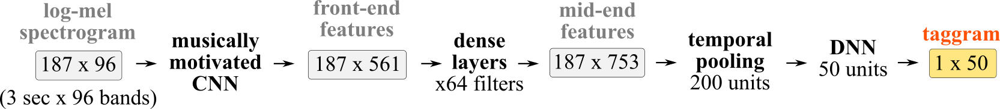
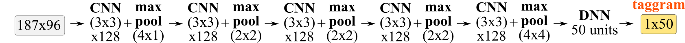

# Documentation

### Table of contents

[Training datasets: `MTT` and `MSD`](#datasets)  
[Included models: `musicnn` and `vgg`](#models)  
[Python interface: music tagger](#python_top_tags)  
[Python interface: music feature extractor](#python_extractor)  
[Command-line interface: music tagger](#command)  

## Training datasets: `MTT` and `MSD` <a name="datasets"></a>
This repository contains  a set of pre-trained deep convolutional neural networks for music audio tagging, and these are trained with two different datasets: the [MagnaTagATune](https://github.com/keunwoochoi/magnatagatune-list) dataset (the `MTT` of ~19k training songs) and the [Million Song Dataset](https://github.com/jongpillee/music_dataset_split/tree/master/MSD_split) (the `MSD` of ~200k training songs).

The **`MTT`** dataset considers this 50-tags vocabulary: guitar, classical, slow, techno, strings, drums, electronic, rock, fast, piano, ambient, beat, violin, vocal, synth, female, indian, opera, male, singing, vocals, no vocals, harpsichord, loud, quiet, flute, woman, male vocal, no vocal, pop, soft, sitar, solo, man, classic, choir, voice, new age, dance, male voice, female vocal, beats, harp, cello, no voice, weird, country, metal, female voice, choral.

The **`MSD`** dataset considers this 50-tags vocabulary: rock, pop, alternative, indie, electronic, female vocalists, dance, 00s, alternative rock, jazz, beautiful, metal, chillout, male vocalists, classic rock, soul, indie rock, Mellow, electronica, 80s, folk, 90s, chill, instrumental, punk, oldies, blues, hard rock, ambient, acoustic, experimental, female vocalist, guitar, Hip-Hop, 70s, party, country, easy listening, sexy, catchy, funk, electro, heavy metal, Progressive rock, 60s, rnb, indie pop, sad, House, happy.

## Included models: `musicnn` and `vgg` <a name="models"></a>
**`musicnn`** is a musically motivated convolutional neural network (CNN) trained for music audio tagging. It consists of a CNN front-end that is [musically motivated](https://ieeexplore.ieee.org/abstract/document/7500246/), of a [densely connected](https://arxiv.org/abs/1608.06993) mid-end, and a [temporal-pooling](https://arxiv.org/abs/1711.02520) back-end is employed for the output layers. For more details about musicnn, check this [jupyter notebook](https://github.com/jordipons/musicnn/blob/master/musicnn_example.ipynb).

<br>
<p align="center">
  
</p>

For the [Million Song Dataset](https://github.com/jongpillee/music_dataset_split/tree/master/MSD_split), we also include a larger model with more capacity: the `MSD_musicnn_big`. This model is based on `musicnn`, but the dense-layered mid-end has x512 filters (instead of x64) and the temporal-pooling back-end has 500 units (instead of 200).

The following models are available: `'MTT_musicnn'`, `'MSD_musicnn'`, and `'MSD_musicnn_big'`.

**Important!** `'MSD_musicnn_big'` is only available if you install from source: `python setup.py install`.

**`vgg`** is a [computer vision](https://www.quora.com/What-is-the-VGG-neural-network) baseline model that we trained for music audio tagging. This [naive adaption](https://arxiv.org/abs/1606.00298) of a vision CNN for audio-spectrograms stacks several 3x3 CNN layers with max pooling. For more details about our vgg implementation, check this [jupyter notebook](https://github.com/jordipons/musicnn/blob/master/vgg_example.ipynb).

<br>
<p align="center">

</p>

The following models are available: `'MTT_vgg'`, `'MSD_vgg'`.

## Python interface: music tagger <a name="python_top_tags"></a>

```python
tags = musicnn.tagger.top_tags(file_name, model='MTT_musicnn', topN=3, input_length=3, input_overlap=None, print_tags=True, save_tags=False)
```
Predict the `topN` tags of the music-clip in `file_name` with the selected `model`.  

**Input**
- **file_name:** path to the music file to tag.  
*Data format:* string.  
*Example:* './audio/TRWJAZW128F42760DD_test.mp3'
- **model:** select a music audio tagging model.  
*Data format:* string.  
*Options:* `'MTT_musicnn'`, `'MTT_vgg'`, `'MSD_musicnn'`, `'MSD_musicnn_big'` or `'MSD_vgg'`.  
`MTT` models are trained with the [MagnaTagATune](https://github.com/keunwoochoi/magnatagatune-list) dataset.  
`MSD` models are trained with the [Million Song Dataset](https://github.com/jongpillee/music_dataset_split/tree/master/MSD_split).  
To know more about these models, check our [musicnn](https://github.com/jordipons/musicnn/blob/master/musicnn_example.ipynb) / [vgg](https://github.com/jordipons/musicnn/blob/master/vgg_example.ipynb) examples, and the [FAQs](https://github.com/jordipons/musicnn/blob/master/FAQs.md).  
*Important!* `'MSD_musicnn_big'` is only available if you install from source: `python setup.py install`.
- **topN:** extract N most likely tags according to the selected model.  
*Data format:* integer.  
*Example:* 3
- **input_length:** length (in seconds) of the input spectrogram patches. Set it small for real-time applications.   
*Note:* This is the length of the data that is going to be fed to the model. In other words, this parameter defines the temporal resolution of the taggram.  
*Recommended value:* 3, because the models were trained with 3 second inputs.  
*Observation:* the `vgg` models do not allow for different input lengths. For this reason, the `vgg` models' input_length needs to be set to 3. However, `musicnn` models allow for different input lengths: see this [jupyter notebook](https://github.com/jordipons/musicnn/blob/master/musicnn_example.ipynb).  
*Data format:* floating point number.  
*Example:* 3.1
- **input_overlap:** ammount of overlap (in seconds) of the input spectrogram patches.  
*Note:* Set it considering the `input_length`.  
*Data format:* floating point number.  
*Example:* 1.0
- **print_tags:** set it `True` for printing the tags.  
*Note:* although you don't print the tags, these will be returned by the `musicnn.tagger.top_tags()` function.  
*Data format:* boolean.  
*Options:* `False` (for NOT printing the tags), `True` (for printing the tags).  
- **save_tags:** Path where to store/save the tags.  
*Data format:* string.  
*Example:* 'file_name.tags'  
  
**Output**
- **tags:** `topN` most likely tags of the music-clip in `file_name` considering the selected `model`.    
*Data format:* list.  
*Example:* ['synth', 'techno']

## Python interface: music feature extractor <a name="python_extractor"></a>

```python
taggram, tags, features = musicnn.extractor.extractor(file_name, model='MTT_musicnn', input_length=3, input_overlap=None, extract_features=True)
```
Extract the `taggram` (the temporal evolution of tags) and `features` (intermediate representations of the model) of the music-clip in `file_name` with the selected `model`.  

**Input**
- **file_name:** path to the music file to tag.  
*Data format:* string.  
*Example:* './audio/TRWJAZW128F42760DD_test.mp3'
- **model:** select a music audio tagging model.  
*Data format:* string.  
*Options:* `'MTT_musicnn'`, `'MTT_vgg'`, `'MSD_musicnn'`, `'MSD_musicnn_big'` or `'MSD_vgg'`.  
`MTT` models are trained with the [MagnaTagATune](https://github.com/keunwoochoi/magnatagatune-list) dataset.  
`MSD` models are trained with the [Million Song Dataset](https://github.com/jongpillee/music_dataset_split/tree/master/MSD_split).  
To know more about these models, check our [musicnn](https://github.com/jordipons/musicnn/blob/master/musicnn_example.ipynb) / [vgg](https://github.com/jordipons/musicnn/blob/master/vgg_example.ipynb) examples, and the [FAQs](https://github.com/jordipons/musicnn/blob/master/FAQs.md).  
*Important!* `'MSD_musicnn_big'` is only available if you install from source: `python setup.py install`.
- **input_length:** length (in seconds) of the input spectrogram patches. Set it small for real-time applications.   
*Note:* This is the length of the data that is going to be fed to the model. In other words, this parameter defines the temporal resolution of the taggram.  
*Recommended value:* 3, because the models were trained with 3 second inputs.   
*Observation:* the `vgg` models do not allow for different input lengths. For this reason, the `vgg` models' input_length needs to be set to 3. However, `musicnn` models allow for different input lengths: see this [jupyter notebook](https://github.com/jordipons/musicnn/blob/master/musicnn_example.ipynb).  
*Data format:* floating point number.  
*Example:* 3.1
- **input_overlap:** ammount of overlap (in seconds) of the input spectrogram patches.  
*Note:* Set it considering the `input_length`.  
*Data format:* floating point number.  
*Example:* 1.0
- **extract_features:** set it `True` for extracting the intermediate representations of the model.  
*Data format:* boolean.  
*Options:* `False` (for NOT extracting the features), `True` (for extracting the features).  
  
**Output**
- **taggram:**  expresses the temporal evolution of the tags likelihood.  
*Data format:* 2D np.ndarray (time, tags).  
*Example:* see our [basic](https://github.com/jordipons/musicnn/blob/master/tagging_example.ipynb) / [advanced](https://github.com/jordipons/musicnn/blob/master/musicnn_example.ipynb) examples.  
- **tags:** list of tags corresponding to the tag-indices of the taggram.  
*Data format:* list.  
*Example:* see our [FAQs](https://github.com/jordipons/musicnn/blob/master/FAQs.md) page for the complete tags list.
- **features:** if `extract_features = True`, it outputs a dictionary containing the activations of the different layers the selected model has.  
*Data format:* dictionary.  
*Keys (musicnn models)*: ['timbral',  'temporal', 'cnn1', 'cnn2', 'cnn3', 'mean_pool', 'max_pool', 'penultimate']  
*Keys (vgg models)*: ['pool1',  'pool2', 'pool3', 'pool4', 'pool5']  
*Example:* see our [musicnn](https://github.com/jordipons/musicnn/blob/master/musicnn_example.ipynb) and [vgg](https://github.com/jordipons/musicnn/blob/master/vgg_example.ipynb) examples.

## Command-line interface: music tagger <a name="command"></a>

```
python -m musicnn.tagger file_name --model 'MTT_musicnn' --topN 3 --length 3 --overlap 3 --print --save file.tags
```
Predict the `topN` tags of the music-clip in `file_name` with the selected `model`.  

**Arguments**
- **file_name:** path to the music file to tag.  
*Data format:* string.  
*Example:* `python -m musicnn.tagger music.mp3`  
- **--model (-mod):** select a music audio tagging model.  
*Data format:* string.  
*Options:* `MTT_musicnn`, `MTT_vgg`, `MSD_musicnn`, `MSD_musicnn_big` or `MSD_vgg`.  
`MTT` models are trained with the [MagnaTagATune](https://github.com/keunwoochoi/magnatagatune-list) dataset.  
`MSD` models are trained with the [Million Song Dataset](https://github.com/jongpillee/music_dataset_split/tree/master/MSD_split).  
To know more about these models, check our [musicnn](https://github.com/jordipons/musicnn/blob/master/musicnn_example.ipynb) / [vgg](https://github.com/jordipons/musicnn/blob/master/vgg_example.ipynb) examples, and the [FAQs](https://github.com/jordipons/musicnn/blob/master/FAQs.md).  
*Important!* `MSD_musicnn_big` is only available if you install from source: `python setup.py install`.  
*Default:* `MTT_musicnn`  
*Example:* `python -m musicnn.tagger music.mp3 --model MSD_musicnn`  
- **--topN (-n):** extract N most likely tags according to the selected model.  
*Data format:* integer.  
*Default:* 3  
*Example:* `python -m musicnn.tagger music.mp3 --topN 10`  
- **--length (-len):** length (in seconds) of the input spectrogram patches. Set it small for real-time applications.   
*Note:* This is the length of the data that is going to be fed to the model. In other words, this parameter defines the temporal resolution of the taggram.    
*Recommended value:* 3, because the models were trained with 3 second inputs.   
*Observation:* the `vgg` models do not allow for different input lengths. For this reason, the `vgg` models' input_length needs to be set to 3. However, `musicnn` models allow for different input lengths: see this [jupyter notebook](https://github.com/jordipons/musicnn/blob/master/musicnn_example.ipynb).  
*Data format:* floating point number.  
*Default:* 3.0  
*Example:* `python -m musicnn.tagger music.mp3 -len 3.1`  
- **--overlap (-ov):** ammount of overlap (in seconds) of the input spectrogram patches.  
*Note:* Set it considering the `input_length`.  
*Data format:* floating point number.  
*Default:* 3.0  
*Example:* `python -m musicnn.tagger music.mp3 -ov 1.0`  
- **--print (-p):** employ this flag for printing the tags.  
*Data format:* boolean.  
*Example:* `python -m musicnn.tagger music.mp3 --print`  
- **--save  (-s):** Path where to store/save the tags.  
*Data format:* string.  
*Output data format:* csv.  
*Example:* `python -m musicnn.tagger music.mp3 --save out.tags`  

  
**Output**
- **tags:** `topN` most likely tags of the music-clip in `file_name` considering the selected `model`.    
